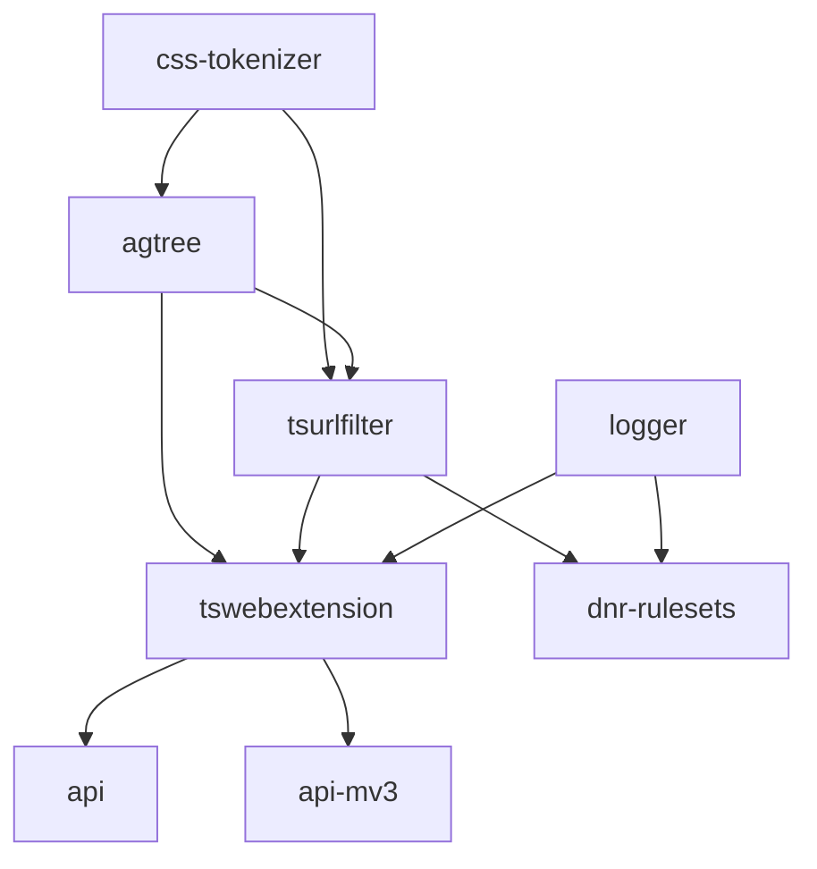

# AGENTS.md

## Project Overview

This monorepo contains a collection of TypeScript libraries used in AdGuard
browser extensions and other projects. It provides a full stack for content
blocking — from filter list parsing (`agtree`) and rule matching
(`tsurlfilter`) to browser extension integration (`tswebextension`) and
high-level extension APIs (`adguard-api`, `adguard-api-mv3`).

## Technical Context

- **Language/Version**: TypeScript, Node.js ≥ 22
- **Package Manager**: pnpm v10 with workspaces and
  [catalogs](https://pnpm.io/catalogs) (`pnpm-workspace.yaml`)
- **Orchestration**: Lerna 8 (independent versioning) + Nx (cacheable builds)
- **Testing**: Vitest (root config delegates to per-package configs)
- **Linting**: ESLint (per-package configs), markdownlint in some packages
- **Target Platform**: Node.js, browser extensions (MV2 and MV3)
- **Project Type**: Monorepo

## Project Structure

```text
.
├── packages/
│   ├── logger/                      # @adguard/logger — logging library
│   ├── css-tokenizer/               # @adguard/css-tokenizer — CSS tokenizer
│   ├── agtree/                      # @adguard/agtree — filter list parser & AST
│   ├── tsurlfilter/                 # @adguard/tsurlfilter — blocking rules engine
│   ├── tswebextension/              # @adguard/tswebextension — web extension API wrapper
│   ├── dnr-rulesets/                # @adguard/dnr-rulesets — DNR ruleset builder (CLI + lib)
│   ├── adguard-api/                 # @adguard/api — high-level extension API (MV2)
│   ├── adguard-api-mv3/            # @adguard/api-mv3 — high-level extension API (MV3)
│   ├── eslint-plugin-logger-context/ # @adguard/eslint-plugin-logger-context
│   ├── examples/                    # Sample browser extensions
│   │   ├── adguard-api/             # Example using @adguard/api
│   │   ├── adguard-api-mv3/        # Example using @adguard/api-mv3
│   │   ├── tswebextension-mv2/     # Example using tswebextension (MV2)
│   │   └── tswebextension-mv3/     # Example using tswebextension (MV3)
│   └── benchmarks/                  # Performance benchmarks
│       ├── agtree-benchmark/        # AGTree parser benchmarks
│       ├── agtree-browser-benchmark/ # AGTree browser benchmarks
│       ├── css-tokenizer-benchmark/ # CSS tokenizer benchmarks
│       └── tsurlfilter-benchmark/   # TSUrlFilter benchmarks
├── scripts/                         # Monorepo-level scripts (cleanup, increment)
├── bamboo-specs/                    # CI pipeline definitions
├── package.json                     # Root package config
├── pnpm-workspace.yaml              # Workspace and catalog definitions
├── lerna.json                       # Lerna config (independent versioning)
├── nx.json                          # Nx task runner config
└── vitest.config.ts                 # Root Vitest config (delegates to packages)
```

### Dependency Tree



## Build And Test Commands

All commands are run from the repository root unless noted otherwise.

- **Install dependencies**: `pnpm install`
- **Lint all packages**: `pnpm lint`
- **Run all tests**: `npx lerna run test`
- **Build all packages**: `npx lerna run build`
- **Build a specific package**: `npx lerna run build --scope=<package-name>`
  (e.g. `--scope=@adguard/tsurlfilter`; Lerna builds dependencies
  automatically)
- **Clean all `node_modules`**: `pnpm clean`
- **Reinstall from scratch**: `pnpm reinstall` (or `pnpm ri`)
- **Increment a package version**: `pnpm run increment <package-name>`
- **Pack release tarballs**: `pnpm tgz` (builds and packs `dnr-rulesets`,
  `api`, `api-mv3` with dependencies)

## Contribution Instructions

You MUST follow the following rules for EVERY task that you perform:

- You MUST verify your changes pass static analysis in every touched package
  before completing a task. Run the package's own `pnpm lint` (which typically
  runs `lint:code` and `lint:types`).

- You MUST run the package's test suite to verify your changes do not break
  existing functionality: `pnpm test` in the package directory.

- For `@adguard/tsurlfilter` and `@adguard/tswebextension`, build first
  (`pnpm build`), then run `pnpm test:prod` which includes lint, smoke tests,
  and the full test suite.

- You MUST use `workspace:^` for internal monorepo dependencies.

- Shared dependency versions are managed via pnpm catalogs in
  `pnpm-workspace.yaml`. When adding or updating a common dependency, update
  it there using `catalog:` references.

- When the task is finished, update the per-package `CHANGELOG.md` in the
  `Unreleased` section. Add entries to the appropriate subsection (`Added`,
  `Changed`, or `Fixed`); do not create duplicate subsections.

- When making changes to a package, consider updating changelogs of dependent
  packages that may be affected.

- Each package may have its own `AGENTS.md` with package-specific rules. Always
  check for and follow those rules when working in that package.

- Do NOT manually edit generated outputs (e.g. `dist/`, auto-generated doc
  sections). Use the appropriate build or generation command instead.

## Code Guidelines

### I. Architecture

1. **Monorepo with independent versioning.** Each package is versioned and
   published independently via Lerna. Cross-package references use
   `workspace:^`.

   **Rationale**: Allows packages to evolve at different rates while sharing
   build infrastructure.

2. **Each package is self-contained.** Every package has its own `package.json`,
   `tsconfig.json`, build config (Rollup), lint config, and test config
   (Vitest). Packages define their own `build`, `test`, and `lint` scripts.

   **Rationale**: Enables independent development, testing, and publishing.

3. **Build order follows the dependency tree.** Nx caches `build` targets and
   Lerna respects `dependsOn: ["^build"]` so that dependencies are always built
   before dependents.

   **Rationale**: Prevents stale build artifacts from breaking downstream
   packages.

### II. Code Quality Standards

1. **TypeScript strict mode** is enabled across all packages. Code MUST compile
   cleanly under `pnpm lint:types`.

2. **ESLint** is configured per-package (airbnb-typescript base in most
   packages). Code MUST pass `pnpm lint:code`.

3. **JSDoc** is required in most packages (enforced by `eslint-plugin-jsdoc`).

4. **Consistent `zod` version** across all packages is mandatory to avoid
   schema incompatibility. The version is pinned in `pnpm-workspace.yaml`
   catalogs.

### III. Testing Discipline

1. **Vitest** is the test runner for all packages. Each package has its own
   `vitest.config.ts`.

2. **Smoke tests** are available in several packages to validate that published
   exports resolve correctly (ESM, CJS, TypeScript).

3. **Coverage** is tracked per-package via `@vitest/coverage-v8` where
   configured.

### IV. Other

1. **Shared dependency versions must be identical** across all packages for
   libraries that cross package boundaries. This applies to `zod` (schema
   compatibility), all `@adguard/*` packages (internal workspace refs use
   `workspace:^`), and any other dependency managed via pnpm catalogs in
   `pnpm-workspace.yaml`. Mismatched versions can cause subtle runtime
   errors when objects or schemas are passed between packages.

2. **macOS and Linux** are the supported development platforms. Some commands
   may not work on Windows without WSL.
