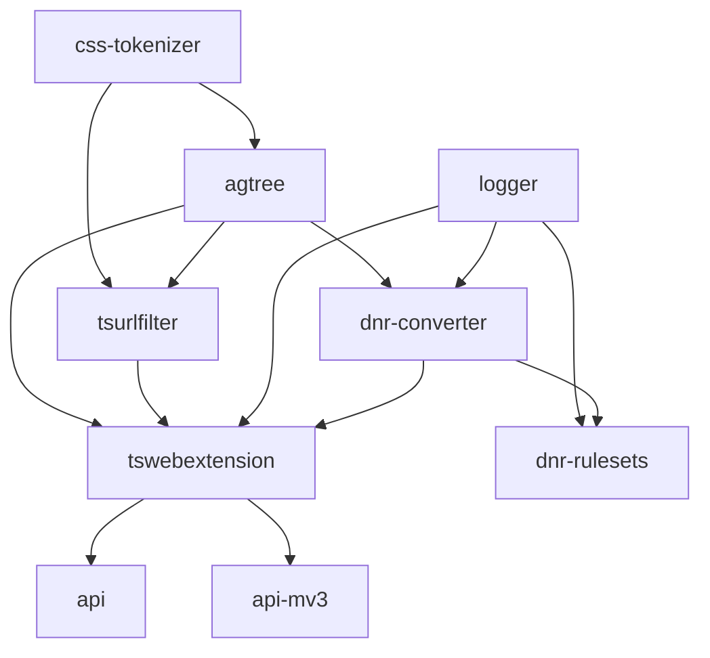

# AGENTS.md

## Project Overview

This monorepo contains a collection of TypeScript libraries used in AdGuard
browser extensions and other projects. It provides a full stack for content
blocking — from filter list parsing (`agtree`) and rule matching
(`tsurlfilter`) to browser extension integration (`tswebextension`) and
high-level extension APIs (`adguard-api`, `adguard-api-mv3`).

## Technical Context

- **Language/Version**: TypeScript, Node.js ≥ 22
- **Package Manager**: pnpm v10.33.4 with workspaces and
  [catalogs](https://pnpm.io/catalogs) (`pnpm-workspace.yaml`)
- **Orchestration**: Lerna 8 (independent versioning) + Nx (cacheable builds)
- **Testing**: Vitest (root config delegates to per-package configs)
- **Linting**: ESLint (per-package configs), markdownlint in some packages
- **Target Platform**: Node.js, browser extensions (MV2 and MV3)
- **Project Type**: Monorepo

## Project Structure

```text
.
├── packages/
│   ├── logger/                      # @adguard/logger — logging library
│   ├── css-tokenizer/               # @adguard/css-tokenizer — CSS tokenizer
│   ├── agtree/                      # @adguard/agtree — filter list parser & AST
│   ├── tsurlfilter/                 # @adguard/tsurlfilter — blocking rules engine
│   ├── dnr-converter/               # @adguard/dnr-converter — DNR rule converter (CLI + lib)
│   ├── tswebextension/              # @adguard/tswebextension — web extension API wrapper
│   ├── dnr-rulesets/                # @adguard/dnr-rulesets — DNR ruleset builder (CLI + lib)
│   ├── adguard-api/                 # @adguard/api — high-level extension API (MV2)
│   ├── adguard-api-mv3/            # @adguard/api-mv3 — high-level extension API (MV3)
│   ├── eslint-plugin-logger-context/ # @adguard/eslint-plugin-logger-context
│   ├── examples/                    # Sample browser extensions
│   │   ├── adguard-api/             # Example using @adguard/api
│   │   ├── adguard-api-mv3/        # Example using @adguard/api-mv3
│   │   ├── tswebextension-mv2/     # Example using tswebextension (MV2)
│   │   └── tswebextension-mv3/     # Example using tswebextension (MV3)
│   └── benchmarks/                  # Performance benchmarks
│       ├── agtree-benchmark/        # AGTree parser benchmarks
│       ├── agtree-browser-benchmark/ # AGTree browser benchmarks
│       ├── css-tokenizer-benchmark/ # CSS tokenizer benchmarks
│       └── tsurlfilter-benchmark/   # TSUrlFilter benchmarks
├── scripts/                         # Cleanup, version injection, and CI helpers
├── package.json                     # Root package config
├── pnpm-workspace.yaml              # Workspace and catalog definitions
├── lerna.json                       # Lerna config (independent versioning)
├── nx.json                          # Nx task runner config
├── Dockerfile                       # Multi-stage Docker CI build
├── .dockerignore                    # Docker build context exclusions
└── vitest.config.ts                 # Root Vitest config (delegates to packages)
```

### Dependency Tree


```mermaid
graph TD
    css-tokenizer --> agtree
    css-tokenizer --> tsurlfilter
    agtree --> tsurlfilter
    agtree --> tswebextension
    agtree --> dnr-converter
    tsurlfilter --> tswebextension
    logger --> tswebextension
    logger --> dnr-rulesets
    logger --> dnr-converter
    dnr-converter --> tswebextension
    dnr-converter --> dnr-rulesets
    tswebextension --> api
    tswebextension --> api-mv3
```

## Build And Test Commands

All commands are run from the repository root unless noted otherwise.

- **Install dependencies**: `pnpm install`
- **Lint all packages**: `pnpm lint`
- **Run all tests**: `npx lerna run test`
- **Build all packages**: `npx lerna run build`
- **Build a specific package**: `npx lerna run build --scope=<package-name>`
  (e.g. `--scope=@adguard/tsurlfilter`; Lerna builds dependencies
  automatically)
- **Clean all `node_modules`**: `pnpm clean`
- **Reinstall from scratch**: `pnpm reinstall` (or `pnpm ri`)
- **Stamp dev versions (CI)**: shared `set-dev-version` action in monorepo
  mode (`package-globs: packages/*/package.json`); release versions are
  injected at pack time by `node scripts/inject-package-versions.mjs
  --package <name> --version <ver>`.
- **Pack release tarballs**: `pnpm tgz` (builds and packs `dnr-rulesets`,
  `api`, `api-mv3` with dependencies)

### CI (Docker)

CI pipelines use `docker buildx build --target <stage> --output type=local,dest=output .`
with the multi-stage `Dockerfile` at the repo root. Each package has dedicated
build/test targets. The `TEST_RUN_ID` build arg busts test-stage caches while
reusing build layers. Per-package `test:ci` scripts produce JUnit XML output.

### GitHub Actions

- `build.yml` — PR/push CI: finds affected packages (workspace dependency
  closure), stamps workspace dev versions via the shared `set-dev-version`
  action, and runs the Docker `test-<package>-output` targets in a matrix.
  Also runs the `docs` job (verifies the regenerated DNR converter docs,
  gated on the dnr-converter closure) and a `workflows` validation job
  (script/Node syntax checks, package-list drift guard, finalize-changelog
  regression tests); a push-scoped failure-notify job alerts Slack on broken
  master builds.
- `devex-bridge.yml` — on same-repository PRs touching any of the six packages
  consumed by the browser extension, publishes them to the internal Artifact
  Keeper npm registry as HEAD-scoped `<next-patch>-dev.pr<N>.<shortsha>`
  versions (AK is immutable; every push carries a new short SHA, so each push
  yields fresh builds for all six) and posts a usage comment on the PR.
  Same-repo PRs only (publishes use the org AK secret). Requires the org
  variable `ARTIFACT_KEEPER_URL` and secret `ARTIFACT_KEEPER_API_KEY`. See
  DEVELOPMENT.md for the developer workflow.
- `devex-bridge-cleanup.yml` — when a source PR closes, deletes its
  `-dev.pr<N>*` versions from AK (fail-loud; requires the same `ARTIFACT_KEEPER_*`
  pair), and is also reachable via `workflow_dispatch` (input `pr-number`) as an
  idempotent retry.
- `devex-bridge-sweep.yml` — scheduled GC (every 6h, plus `workflow_dispatch`):
  deletes `-dev.pr<N>*` versions whose source PR is no longer open, so the
  cleanup converges even when a `closed` event was missed or failed.
- `prepare-release.yml` — opens a per-package release PR (thin caller of
  `_prepare-release-monorepo.yml`).
- `_prepare-release-monorepo.yml` — reusable monorepo prepare engine: finalizes
  the package changelog via `.github/actions/finalize-changelog/finalize-changelog.mjs`,
  pushes `release-bump/<package>-v<version>`, opens the release PR.
- `publish-release.yml` — publishes a package to npm after the release PR
  merges (Docker test/build → npm → tag `<package>-v<version>` — created only
  after the publish succeeds → mirror → GitHub Release → Slack); thin caller of
  `_publish-release-monorepo.yml`.
- `_publish-release-monorepo.yml` — reusable monorepo publish engine
  (Docker test/build → npm → tag after publish → mirror → GitHub Release →
  Slack, with a failure-notify Slack job).
- `publish-stable-dnr-rulesets.yml` — twice-daily scheduled build/publish of
  `@adguard/dnr-rulesets` from the `stable/dnr-rulesets-5.0` branch. Only the
  5.0 line is published (under `latest`); the older stable lines are no longer
  published. The branch must be on the current CI (root `Dockerfile` +
  `scripts/inject-package-versions.mjs`); a `resolve-lines` job checks branch
  readiness and skips gracefully if not yet migrated, the job checks the
  branch out, stamps a `<line>.<timestamp>` stable version, builds its own
  `dnr-rulesets-auto-build-output` Docker target, and publishes it. The exact
  version is checked for idempotency before publishing
  (`scripts/ci/check-npm-version.sh`), and a failed publish gets one retry
  after a backoff (outlasts npm's throttle window). The line publishes under
  the `latest` npm dist-tag (no older line exists to pull it backwards) with
  no environment restriction. A failure-notify job alerts Slack when any leg
  fails.
- `mirror.yml` — syncs master to the public `AdguardTeam/tsurlfilter` mirror.
- `update-companiesdb.yml` — refreshes the tswebextension companies database
  every Tuesday and pushes meaningful changes with Octopass. The push avoids
  `[skip ci]` so the change also reaches the public mirror, and a failure-notify
  job alerts Slack on a failed refresh.

Release docs live in [DEPLOYMENT.md](DEPLOYMENT.md) and [.github/docs/](.github/docs/).
Bamboo has been decommissioned; all active CI and automation run in GitHub
Actions.

## Contribution Instructions

You MUST follow the following rules for EVERY task that you perform:

- You MUST verify your changes pass static analysis in every touched package
  before completing a task. Run the package's own `pnpm lint` (which typically
  runs `lint:code` and `lint:types`).

- You MUST run the package's test suite to verify your changes do not break
  existing functionality: `pnpm test` in the package directory.

- For `@adguard/tsurlfilter` and `@adguard/tswebextension`, build first
  (`pnpm build`), then run `pnpm test:prod` which includes lint, smoke tests,
  and the full test suite.

- You MUST use `workspace:^` for internal monorepo dependencies.

- Shared dependency versions are managed via pnpm catalogs in
  `pnpm-workspace.yaml`. When adding or updating a common dependency, update
  it there using `catalog:` references.

- When the task is finished, update the per-package `CHANGELOG.md` in the
  `Unreleased` section. Add entries to the appropriate subsection (`Added`,
  `Changed`, or `Fixed`); do not create duplicate subsections.

- Do NOT describe internal process or infrastructure changes (CI, build,
  release tooling, repository moves) in public `CHANGELOG.md` files —
  changelogs are user-facing. Only user-visible behavioral changes belong in
  them; describe internal changes in the PR or commit message instead.

- When making changes to a package, consider updating changelogs of dependent
  packages that may be affected.

- Each package may have its own `AGENTS.md` with package-specific rules. Always
  check for and follow those rules when working in that package.

- Do NOT manually edit generated outputs (e.g. `dist/`, auto-generated doc
  sections). Use the appropriate build or generation command instead.

## Code Guidelines

### I. Architecture

1. **Monorepo with independent releases.** Each package is published
  independently. Versions live in package changelogs and are injected at
  build time; cross-package references use `workspace:^`.

   **Rationale**: Allows packages to evolve at different rates while sharing
   build infrastructure.

2. **Each package is self-contained.** Every package has its own `package.json`,
   `tsconfig.json`, build config (Rollup), lint config, and test config
   (Vitest). Packages define their own `build`, `test`, and `lint` scripts.

   **Rationale**: Enables independent development, testing, and publishing.

3. **Build order follows the dependency tree.** Nx caches `build` targets and
   Lerna respects `dependsOn: ["^build"]` so that dependencies are always built
   before dependents.

   **Rationale**: Prevents stale build artifacts from breaking downstream
   packages.

### II. Code Quality Standards

1. **TypeScript strict mode** is enabled across all packages. Code MUST compile
   cleanly under `pnpm lint:types`.

2. **ESLint** is configured per-package (airbnb-typescript base in most
   packages). Code MUST pass `pnpm lint:code`.

3. **JSDoc** is required in most packages (enforced by `eslint-plugin-jsdoc`).

4. **Consistent `zod` version** across all packages is mandatory to avoid
   schema incompatibility. The version is pinned in `pnpm-workspace.yaml`
   catalogs.

5. **Do not split logger calls.** Keep the entire log message in a single
   expression (e.g. a template literal) rather than splitting it across
   multiple lines with string concatenation. This makes log messages easier
   to grep for in the codebase.

6. **Function docs use the standard JSDoc style everywhere, `scripts/`
   included.** Document every non-trivial function with a `/** ... */` block
   carrying `@param`/`@returns` tags — the same JSDoc style enforced in
   packages via `eslint-plugin-jsdoc` — rather than a `//`-style comment above
   the definition. This applies to standalone ESM CLI helpers such as
   `scripts/ci/*.mjs` and their workflow callers, not just packaged sources.

   **Rationale**: keeps function contracts greppable and consistent with our
   usual JSDoc style across both packages and tooling scripts.

### III. Testing Discipline

1. **Vitest** is the test runner for all packages. Each package has its own
   `vitest.config.ts`.

2. **Smoke tests** are available in several packages to validate that published
   exports resolve correctly (ESM, CJS, TypeScript).

3. **Coverage** is tracked per-package via `@vitest/coverage-v8` where
   configured.

### IV. Other

1. **Shared dependency versions must be identical** across all packages for
   libraries that cross package boundaries. This applies to `zod` (schema
   compatibility), all `@adguard/*` packages (internal workspace refs use
   `workspace:^`), and any other dependency managed via pnpm catalogs in
   `pnpm-workspace.yaml`. Mismatched versions can cause subtle runtime
   errors when objects or schemas are passed between packages.

2. **macOS and Linux** are the supported development platforms. Some commands
   may not work on Windows without WSL.
