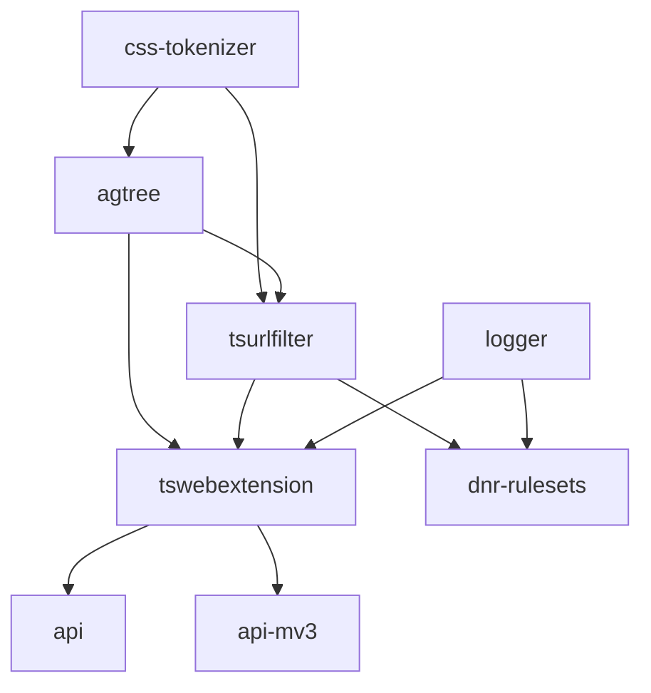

# AdGuard Extensions Libraries

[![badge-open-issues]][open-issues] [![badge-closed-issues]][closed-issues] [![badge-license]][license-url]

This monorepo provides a full stack of TypeScript libraries for content
blocking in browser extensions. It covers every layer — from filter list
parsing and rule matching to browser extension integration and high-level
extension APIs — and is used in AdGuard browser extensions and other projects.

[badge-closed-issues]: https://img.shields.io/github/issues-closed/AdguardTeam/tsurlfilter
[badge-license]: https://img.shields.io/github/license/AdguardTeam/tsurlfilter
[badge-open-issues]: https://img.shields.io/github/issues/AdguardTeam/tsurlfilter
[closed-issues]: https://github.com/AdguardTeam/tsurlfilter/issues?q=is%3Aissue+is%3Aclosed
[license-url]: https://github.com/AdguardTeam/tsurlfilter/blob/master/LICENSE
[open-issues]: https://github.com/AdguardTeam/tsurlfilter/issues

## Key Concepts

The libraries are organized in layers, each building on the previous one:

1. **Parsing** — `css-tokenizer` and `agtree` turn raw filter list text into
   structured tokens and AST nodes.
2. **Matching** — `tsurlfilter` takes parsed rules, builds lookup tables, and
   evaluates network requests and cosmetic rules against them.
3. **Extension integration** — `tswebextension` wraps the browser WebExtension
   API (both MV2 and MV3) to apply filtering decisions from the engine.
4. **High-level API** — `adguard-api` and `adguard-api-mv3` add filter list
   management (downloading, caching, auto-updates) on top of `tswebextension`.

Supporting packages include `logger` (logging), `dnr-rulesets` (prebuilt
Declarative Net Request rulesets for MV3), and
`eslint-plugin-logger-context` (ESLint rule for logger call formatting).

## Packages

### Core Libraries

| Package | Description |
|---|---|
| [`@adguard/tswebextension`][tswebextensionreadme] | Wraps the browser WebExtension API to integrate `tsurlfilter` into MV2 and MV3 extensions. |
| [`@adguard/tsurlfilter`][tsurlfilterreadme] | Content blocking engine — parses AdGuard rules, matches requests, and provides a declarative converter. |
| [`@adguard/agtree`][agtreereadme] | Universal adblock filter list parser, converter, and validator producing a detailed AST. |
| [`@adguard/dnr-rulesets`][dnrrulesetsreadme] | CLI and library for building and loading prebuilt AdGuard DNR rulesets for MV3 extensions. |
| [`@adguard/api`][adguardapireadme] | High-level filtering API for MV2 extensions — manages filter lists and delegates blocking to `tswebextension`. |
| [`@adguard/api-mv3`][adguardapimv3readme] | High-level filtering API for MV3 extensions — MV3 counterpart of `@adguard/api`. |
| [`@adguard/logger`][loggerreadme] | Lightweight logging library with configurable levels and custom writers. |
| [`@adguard/css-tokenizer`][csstokenizerreadme] | Fast, spec-compliant CSS tokenizer for standard and Extended CSS. |
| [`@adguard/eslint-plugin-logger-context`][eslintpluginreadme] | ESLint plugin that enforces context tags in `@adguard/logger` calls. |

### Examples and Benchmarks

| Package | Description |
|---|---|
| [`examples/adguard-api`][exampleadguardapi] | Sample MV2 extension using `@adguard/api`. |
| [`examples/adguard-api-mv3`][exampleadguardapimv3] | Sample MV3 extension using `@adguard/api-mv3`. |
| [`examples/tswebextension-mv2`][exampletswebextensionmv2] | Sample MV2 extension using `@adguard/tswebextension` directly. |
| [`examples/tswebextension-mv3`][exampletswebextensionmv3] | Sample MV3 extension using `@adguard/tswebextension` directly. |
| [`benchmarks/*`][benchmarksdir] | Performance benchmarks for `agtree`, `css-tokenizer`, and `tsurlfilter`. |

[adguardapireadme]: packages/adguard-api/README.md
[adguardapimv3readme]: packages/adguard-api-mv3/README.md
[dnrrulesetsreadme]: packages/dnr-rulesets/README.md
[agtreereadme]: packages/agtree/README.md
[loggerreadme]: packages/logger/README.md
[csstokenizerreadme]: packages/css-tokenizer/README.md
[eslintpluginreadme]: packages/eslint-plugin-logger-context/README.md
[tsurlfilterreadme]: packages/tsurlfilter/README.md
[tswebextensionreadme]: packages/tswebextension/README.md
[exampleadguardapi]: packages/examples/adguard-api
[exampleadguardapimv3]: packages/examples/adguard-api-mv3
[exampletswebextensionmv2]: packages/examples/tswebextension-mv2
[exampletswebextensionmv3]: packages/examples/tswebextension-mv3
[benchmarksdir]: packages/benchmarks

## Dependency Tree

## Documentation

See each package's README for installation and usage instructions.

- [Development guide](DEVELOPMENT.md) — environment setup, build commands,
  and contribution workflow
- [LLM agent rules](AGENTS.md) — project context for AI coding assistants
- [Changelog per package](packages/) — each package has its own `CHANGELOG.md`
- [License](LICENSE)
